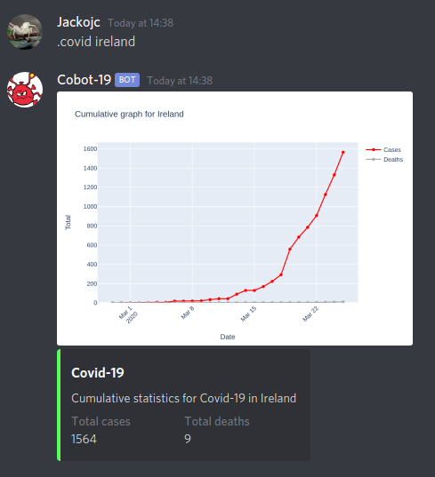

# cobot-19
A discord bot which graphs current statistics relating to Covid-19.

Required packages:
- Plotly
- Requests
- Fuzzywuzzy
- Discordpy

To use the bot, first create a file named "token.txt" and insert your bot token into it, then run `run.sh`.

Obviously you will need a bot account and have invited the bot to your server.

